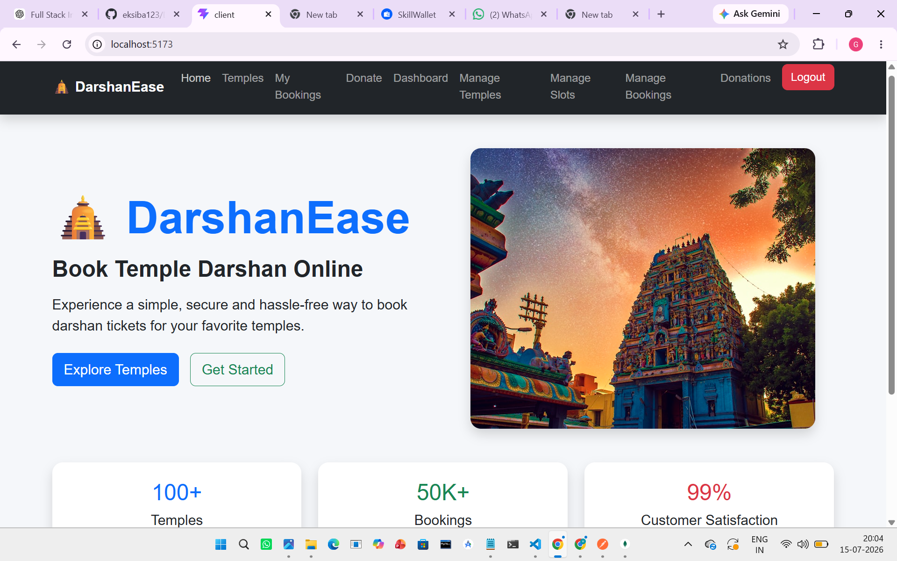
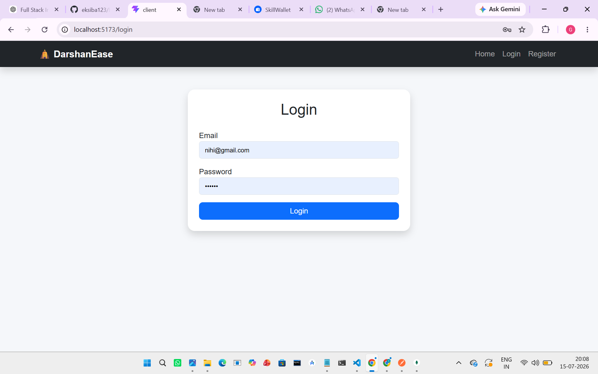
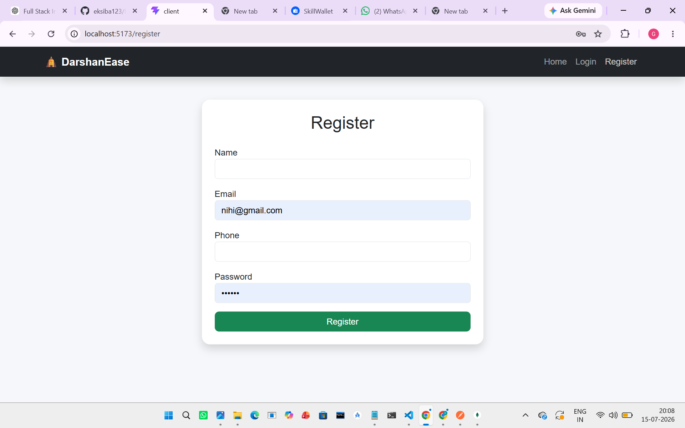
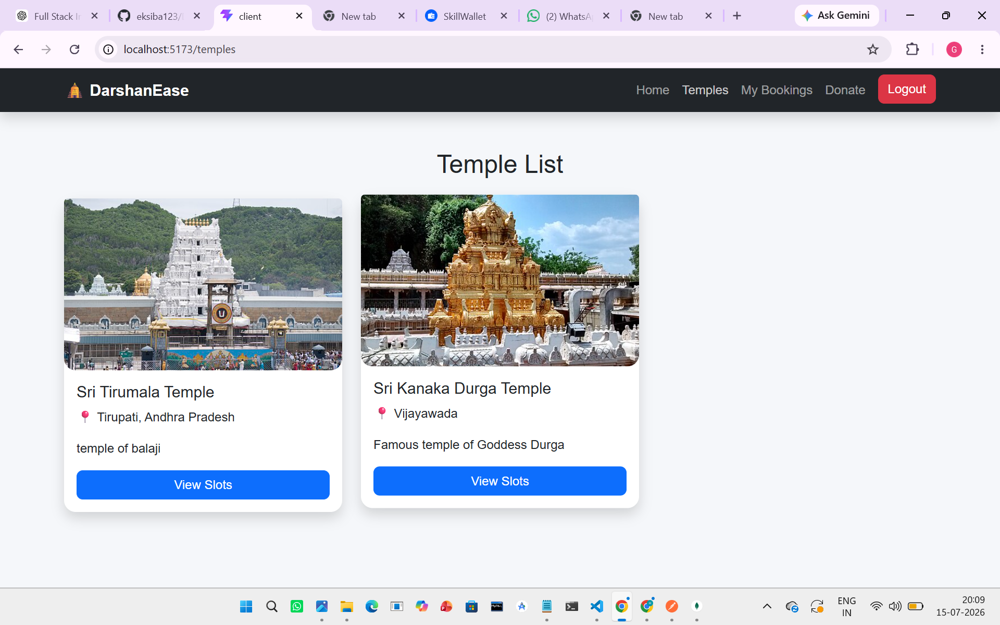
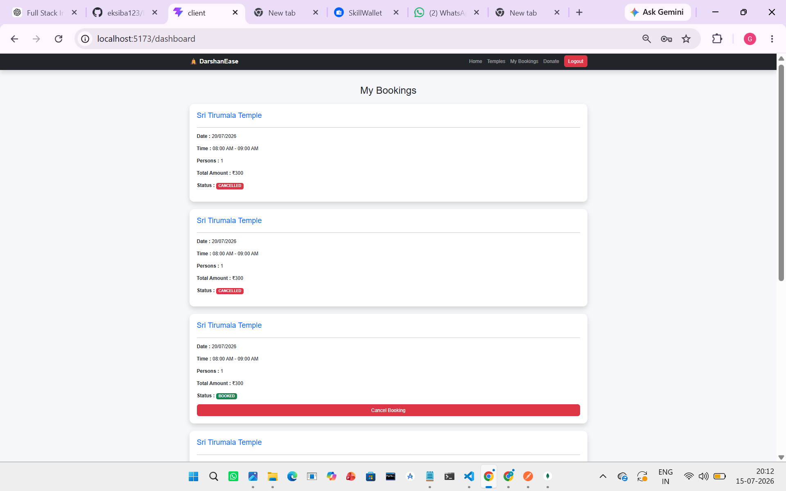
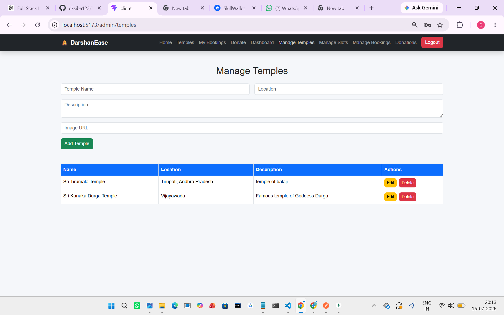
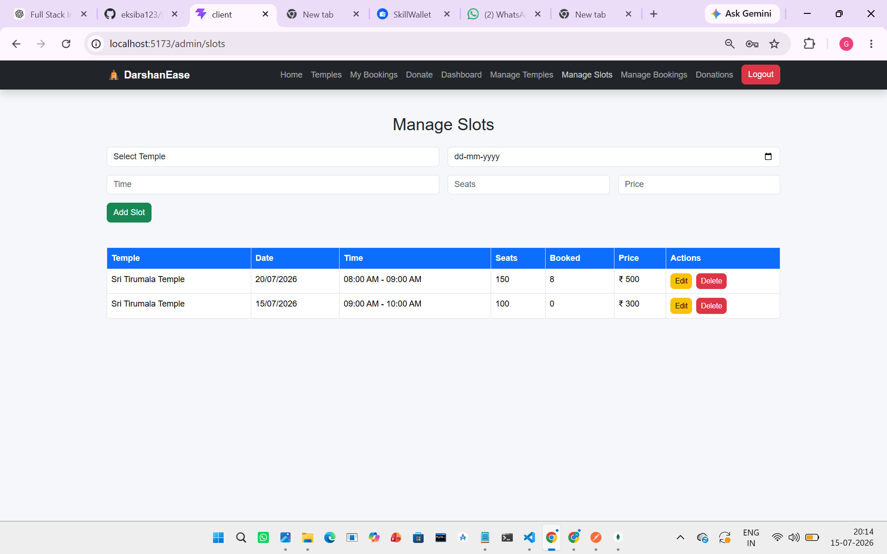
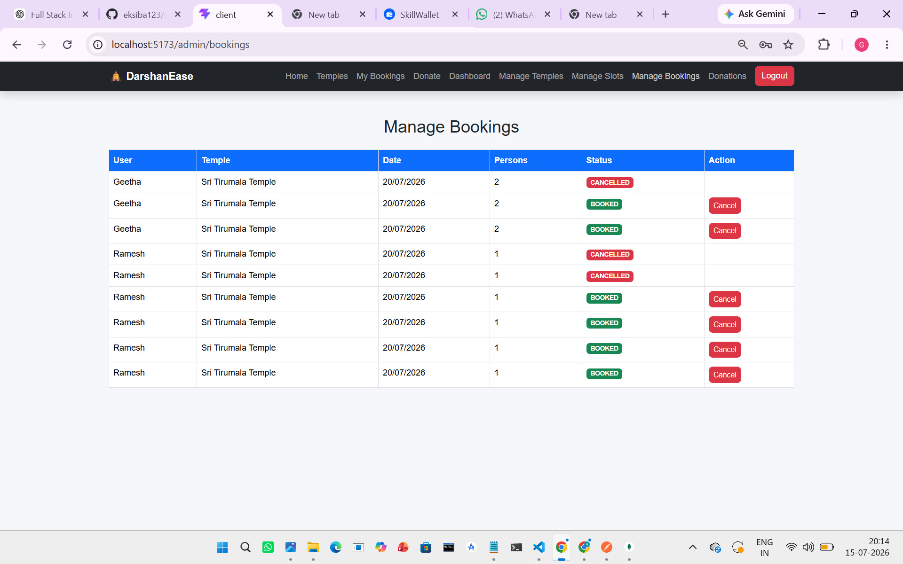
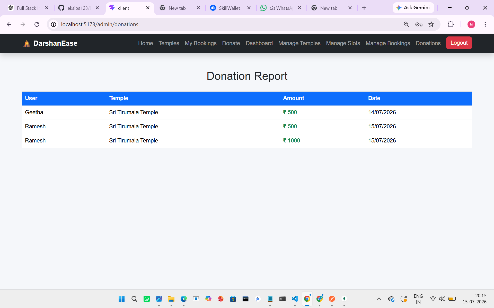

<<<<<<< HEAD
https://github.com/eksiba123/DarshanEase/commit/efc0dc4773bae859b9923a7a010c641e9903bad3
=======
# 🛕 DarshanEase

An Online Temple Darshan Booking System developed using the MERN Stack. The application enables devotees to book darshan tickets online, manage bookings, donate to temples, and provides an admin panel to efficiently manage temples, slots, bookings, and donations.

---

## 📖 Project Overview

DarshanEase is designed to simplify temple darshan management by replacing manual booking with an online platform. Users can register, log in, explore temples, book available darshan slots, make donations, and manage their bookings. Administrators can manage temples, slots, bookings, donations, and monitor overall system statistics through a dashboard.

---

## ✨ Features

### 👤 User Module

- User Registration & Login
- Secure JWT Authentication
- View Available Temples
- View Darshan Slots
- Book Darshan Tickets
- Cancel Bookings
- Make Donations
- View Booking History

### 👨‍💼 Admin Module

- Admin Dashboard
- Manage Temples (Add, Edit, Delete)
- Manage Darshan Slots (Add, Edit, Delete)
- View & Manage Bookings
- View Donation Reports
- Dashboard Statistics

---

## 🔐 Authentication & Security

- JWT Authentication
- Password Encryption using BCrypt
- Role-Based Authorization (Admin/User)
- Protected Routes
- Secure REST APIs

---

## 🛠 Tech Stack

### Frontend

- React.js
- Bootstrap 5
- React Router DOM
- Axios
- React Toastify

### Backend

- Node.js
- Express.js

### Database

- MongoDB
- Mongoose

### Authentication

- JWT
- BCrypt

---

## 📂 Project Structure

```
DarshanEase
│
├── client
│   ├── src
│   ├── public
│   └── package.json
│
├── server
│   ├── config
│   ├── controllers
│   ├── middleware
│   ├── models
│   ├── routes
│   ├── utils
│   ├── app.js
│   ├── server.js
│   └── package.json
│
├── screenshots
├── README.md
```

---

## 🚀 Installation & Setup

### Clone Repository

```bash
git clone https://github.com/eksiba123/DarshanEase.git
```

### Backend Setup

```bash
cd server
npm install
npm start
```

### Frontend Setup

```bash
cd client
npm install
npm run dev
```

---

## 📸 Project Screenshots

### 🏠 Home Page



---

### 🔑 Login



---

### 📝 Registration



---

### 🛕 Temple List



---


### 📋 My Bookings



---


### 🛕 Manage Temples



---

### 📅 Manage Slots



---

### 📖 Manage Bookings



---

### 💰 Donation Report



---

## 🎥 Demo Video

Watch the complete project demonstration here:

https://drive.google.com/file/d/1UAIEio-tWPGYaeomyd-SS83vcee2ZCyK/view?usp=sharing

---------------------

## 👥 Team Members

- Korrapati Eksiba
- Geethanvitha Nadendla
- Islavathu Bhavani
- TIRUMALASETTI LIKITH
- Battula Venu Gopal Varma

---

## 🔮 Future Enhancements

- Online Payment Gateway Integration
- QR Code Based Darshan Entry
- Email & SMS Notifications
- Temple-wise Analytics
- User Profile Management
- Mobile Application
- Multi-language Support

---

## 🎯 Learning Outcomes

- MERN Stack Development
- REST API Development
- JWT Authentication
- CRUD Operations
- MongoDB Integration
- Role-Based Access Control
- React Routing
- State Management
- Full Stack Application Development

---

## 🙏 Acknowledgement

This project was developed as part of our academic curriculum to gain practical experience in Full Stack Web Development using the MERN Stack.

---

## 📜 License

This project is developed for educational purposes.
>>>>>>> b2368f4 (Initial commit)
